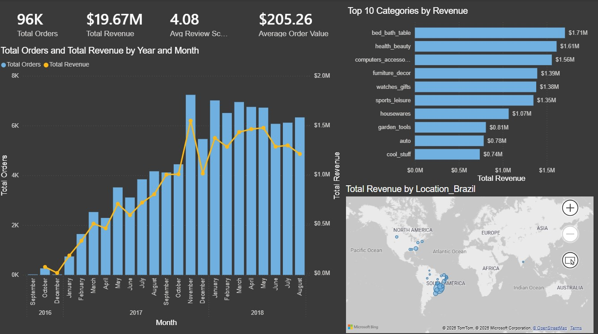
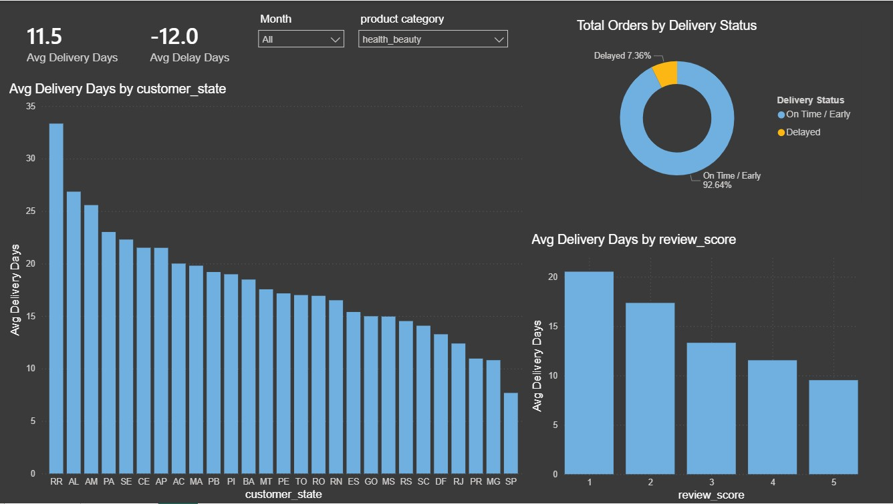

# Olist E-Commerce Analysis

🚀 **Live Interactive Web App:** [Olist Delivery Delay Predictor](https://olist-ecommerce-analysis-rf.streamlit.app/)
## Overview
An end-to-end data science project on the Olist Brazilian E-Commerce dataset (99,000+ orders from 2016–2018). This project spans the entire data lifecycle: from data cleaning and exploratory analysis to an interactive Power BI dashboard and **predictive machine learning models to forecast delivery delays.**

The goal of this project is to uncover actionable insights around customer satisfaction, delivery performance, and product category trends.

## Dataset
- Source: [Olist E-Commerce Dataset — Kaggle](https://www.kaggle.com/datasets/olistbr/brazilian-ecommerce)
- 9 tables, 100,000+ orders, 2 years of data
- Covers customers, orders, payments, reviews, products and sellers

## Key Findings

### 1. Late deliveries are the #1 driver of poor reviews
Orders arriving even slightly late (0–10 days) drop from an average score of 4.16 to 2.50. Orders 10+ days late average just 1.71 — effectively a 1–2 star experience.

### 2. Bed, bath & table is the most ordered category
Followed by health & beauty and sports & leisure. Olist's strength is in everyday home and lifestyle products.

### 3. Olist was in strong growth through 2016–2018
Monthly orders grew consistently, with a clear Black Friday peak in November 2017 exceeding 8,000 orders in a single month.

### 4. Furniture categories have the worst satisfaction despite high volume
Office furniture averages just 3.55 stars. Bulky items are harder to deliver intact and on time — directly connecting to Finding 1.

### 5. Freight cost and product weight are the biggest predictors of shipping delays
Using Machine Learning feature importance, the predictive models revealed that package weight (`product_weight_g`) and shipping cost (`freight_value`) are the primary drivers of delivery delays, far outweighing product category or customer location. Heavy, expensive-to-ship items are disproportionately vulnerable to logistics failures.

## Dashboard
Built in Power BI Desktop — interactive dashboard with delivery analysis and business overview.




## Predictive Modeling (Machine Learning)
Built a predictive pipeline to forecast whether an order will be delayed (`is_delayed = 1`) before it ships, handling a severe class imbalance (only 6.4% of historical orders were delayed).

* **Models Evaluated:** Random Forest Classifier (Baseline) vs. XGBoost Classifier (Challenger)
* **The Precision-Recall Trade-off:** * The **Random Forest** optimized for higher **Precision (17%)**, minimizing false alarms.
  * **XGBoost** optimized for higher **Recall (54%)**, successfully catching over half of all actual delays by using weighted class parameters (`scale_pos_weight`).
* **Feature Importance:** The models determined that continuous financial and physical attributes (`freight_value`, `product_weight_g`, `price`) hold the highest predictive power for delivery disruptions.
## Business Recommendations

Based on the analysis, three actions would have the highest impact on customer satisfaction:

1. **Prioritize on-time delivery for furniture and bulky items** — these categories combine high order volume with the lowest satisfaction scores, driven by delivery failures.
2. **Set more accurate delivery estimates** — customers are highly sensitive to late arrivals. Even 1–10 days late drops average scores from 4.16 to 2.50. Tighter estimates reduce disappointment.
3. **Focus retention efforts on November** — Black Friday drives the highest order volume. Ensuring delivery capacity during this period protects the platform's most critical sales window.

## Key Skills Demonstrated
- Python (pandas, matplotlib, seaborn)
- Data cleaning & feature engineering
- Exploratory data analysis
- Power BI & DAX
- Git & GitHub
- Business storytelling with data
- Machine Learning (Classification)
- Model Evaluation (Precision/Recall)
- XGBoost & Random Forest

## How to Run
1. Clone this repository
2. Download the [Olist dataset from Kaggle](https://www.kaggle.com/datasets/olistbr/brazilian-ecommerce) and place CSVs in `data/raw/`
3. Run notebooks in order: `01` → `02` → `03`→ `04` 
4. Open `dashboard/olist_dashboard.pbix` in Power BI Desktop

## Project Structure

```
olist-ecommerce-analysis/
├── data/
│   └── raw/          ← original Kaggle CSVs (not tracked by git)
├── notebooks/
│   ├── 01_data_overview.ipynb
│   ├── 02_data_cleaning.ipynb
│   ├── 03_exploratory_analysis.ipynb
│   └── 04_predictive_modeling.ipynb  ← Predictive AI Pipeline
├── app.py            ← Streamlit Web Application Interface
├── requirements.txt  ← Cloud Server Dependencies
├── rf_delivery_model.pkl  ← Serialized Trained Model
├── model_columns.pkl      ← Serialized Matrix Schema
├── outputs/          ← charts and exports (not tracked by git)
└── README.md
```

## Tools Used
- Python (pandas, matplotlib, seaborn, scikit-learn, xgboost )
- Jupyter Notebooks via VS Code
- Git & GitHub
